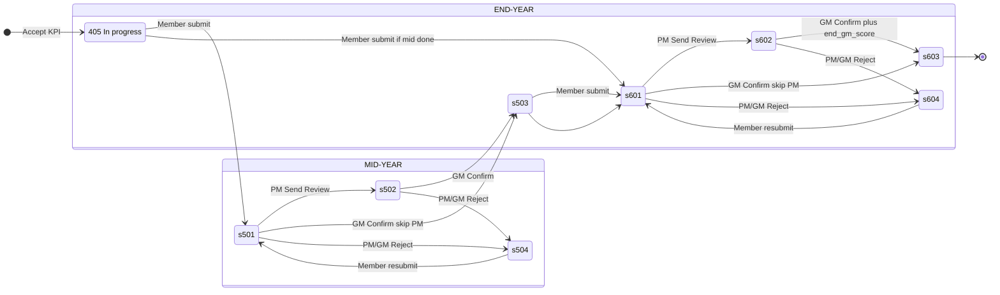

# Luồng đánh giá KPI: Member → PM → GM

Tài liệu mô tả **luồng đánh giá giữa kỳ (Mid-Year)** và **cuối kỳ (End-Year / Year-End)** theo mã nguồn hiện tại (`document/db/init-db.sql`, `MemberKpiService`, `PmDashboardService`, `GmEvaluationHubService`, `EvaluationRejectService`, `StrategicKpiService`).

> **Lưu ý:** Trạng thái vận hành nằm trên từng dòng `kpi_assignments.status_code` (ASM_STATUS). **Không có** bảng `submissions` riêng — “đã nộp đợt” được suy ra từ ASM trên assignment.

---

## 1. Bảng & cột dữ liệu chính

### 1.1. `sys_status_codes` (tham chiếu ASM_STATUS)

| Code | Name | Mô tả ngắn |
|------|------|------------|
| **405** | ACCEPTED | Đã accept KPI — đang thực hiện (trước khi nộp đánh giá) |
| **501** | 1ST_WAITING_PM_APPROVAL | Chờ PM đánh giá giữa kỳ |
| **502** | 1ST_WAITING_GM_APPROVAL | Chờ GM đánh giá giữa kỳ |
| **503** | 1ST_COMPLETED | Hoàn thành giữa kỳ |
| **504** | 1ST_REJECTED | Từ chối giữa kỳ |
| **601** | 2ND_WAITING_PM_APPROVAL | Chờ PM đánh giá cuối kỳ |
| **602** | 2ND_WAITING_GM_APPROVAL | Chờ GM đánh giá cuối kỳ |
| **603** | COMPLETED | Hoàn thành cuối kỳ / chốt vòng đời assignment |
| **604** | 2ND_REJECTED | Từ chối cuối kỳ |

### 1.2. `kpi_assignments` (bảng lõi — partition theo `cycle_id`)

| Cột | Kiểu | Giai đoạn / vai trò |
|-----|------|---------------------|
| `status_code` | INTEGER → `sys_status_codes` | Máy trạng thái toàn bộ luồng |
| `mid_self_score` | NUMERIC(5,2) | **Chỉ giữa kỳ** — điểm tự đánh giá member (và GM tự chấm KPI cá nhân giữa kỳ) |
| `end_self_score` | NUMERIC(5,2) | **Cuối kỳ** — điểm tự đánh giá; cũng dùng nháp ở giai đoạn thiết lập |
| `end_pm_score` | NUMERIC(5,2) | **Chỉ cuối kỳ** — PM chấm (ASM **601**) |
| `end_gm_score` | NUMERIC(5,2) | **Chỉ cuối kỳ** — GM chốt (ASM **601/602 → 603**) |
| `evidences` | JSONB | Actual, minh chứng, nhận xét theo KPI |
| `evaluation_reject_reason` | TEXT | Lý do từ chối khi ASM **504** / **604** |
| `target_value`, `scoring_scale`, … | — | KPI giao / thang điểm (không đổi trong doc này) |

**Không có** cột `mid_pm_score` / `mid_gm_score` trong schema — **giữa kỳ GM/PM không ghi điểm số vào cột riêng**, chỉ xác nhận trạng thái **503**.

Điểm số trên DB có thể được **mã hóa tại ứng dụng** (MyBatis interceptor, xem `V5__score_direct_encryption_no_new_columns.sql`).

### 1.3. `user_kpi_summaries` (nhận xét tổng theo member + chu kỳ)

| Cột | Ai ghi | Nội dung |
|-----|--------|----------|
| `evaluation_comments` | Member | Nhận xét tổng tab BSC / portfolio (không Promotion) |
| `evaluation_comments_promotion` | Member | Nhận xét tổng tab Promotion |
| `evaluation_supervisor_comments` | PM hoặc GM | Nhận xét supervisor tổng (portfolio) |
| `evaluation_supervisor_comments_promotion` | PM hoặc GM | Nhận xét supervisor tổng (Promotion) |
| `final_score`, `final_rating`, `calculation_snapshot` | Chốt sổ / báo cáo | Snapshot cuối (ngoài phạm vi từng bước duyệt) |

### 1.4. `kpi_cycles` (cửa sổ thời gian)

| Cột | Ý nghĩa |
|-----|---------|
| `mid_year_start`, `mid_year_end` | Cửa sổ nộp / hiển thị **giữa kỳ** |
| `end_year_start`, `end_year_end` | Cửa sổ **cuối kỳ** |
| `goal_setting_start`, `goal_setting_end` | Giai đoạn thiết lập / accept KPI (**405**) |

Member onboard **từ `mid_year_start` trở đi** có thể **không bắt buộc** nộp giữa kỳ (`lateOnboardUserForCycle`).

---

## 2. Cấu trúc JSON `kpi_assignments.evidences`

Actual và minh chứng **theo từng KPI** (assignment), không nằm cột `actual` riêng.

| Khóa JSON | Ai thường ghi | Mô tả |
|-----------|---------------|--------|
| `actual` / `result` | Member | Actual tổng hợp (hiển thị cột Actual) |
| `planActualRecords[]` | Member | Mảng `{ plan, actual, comment }` hoặc `{ total, completed, … }` tùy CALC_RULE |
| `note` / `text` / `textNote` | Member | Ghi chú / mô tả minh chứng |
| `urls`, `files`, `evd` | Member | Link & file đính kèm |
| `waTimeRecords` | Member | KPI dạng Work Amount (category B) |
| `gmComment` | **PM và GM** | Nhận xét supervisor **theo từng KPI** (PM cũng ghi vào `gmComment`, không có `pmComment` riêng trên DB mới) |
| `pmComment` | Legacy | Chỉ đọc tương thích DB cũ |

**Mã hóa:** Một số trường nhạy cảm trong `evidences` (và toàn bộ score columns) có thể mã hóa qua `SensitiveDataCryptoService` / MyBatis interceptor.

**Tự tính điểm:** Nếu CALC_RULE = 802 (AVERAGE) và có `planActualRecords`, backend có thể auto ghi `mid_self_score` / `end_self_score` khi member lưu sheet (`computeAutoSelfScoreFromEvidences`).

---

## 3. Sơ đồ trạng thái (Member thông thường)



---

## 4. GIAI ĐOẠN GIỮA KỲ (Mid-Year)

### Điều kiện tiên quyết

- Assignment ở **405** (đã accept KPI sau goal-setting).
- Trong cửa sổ `kpi_cycles.mid_year_start` → `mid_year_end` (hoặc nộp muộn sau `mid_year_end` nếu vẫn 405/504 và chưa từng vào 501+).
- User **không** thuộc nhóm onboard muộn (tạo từ `mid_year_start`) nếu muốn nộp giữa kỳ.

---

### Bước M0 — Member chuẩn bị (405)

| Hành động | API (tham khảo) | Status | Dữ liệu ghi |
|-----------|-----------------|--------|-------------|
| Lưu Actual / minh chứng / điểm nháp | `PUT /v1/kpi/member/sheet/{assignmentId}` | Giữ **405** | `evidences` (JSONB); phase mid → `mid_self_score` (hoặc auto từ evidences) |
| Lưu nhận xét tổng (khi submit sheet) | (kèm submit) | — | `user_kpi_summaries.evaluation_comments` hoặc `_promotion` |

**Validation giữa kỳ khi nộp:** Backend **không bắt buộc** `mid_self_score` trước `submitMemberSheet` (chỉ chặn 402/403/406).

Member **khóa chỉnh sửa** evidences/điểm sau khi assignment vào **501, 502, 601, 602, 603** (trừ khi quay lại **503** sau giữa kỳ — cho phép sửa evidences để chuẩn bị cuối kỳ).

---

### Bước M1 — Member nộp đánh giá giữa kỳ

| Hành động | API | Chuyển ASM | Ghi chú |
|-----------|-----|------------|---------|
| Submit sheet | `POST /v1/kpi/member/sheet/submit` | **405 → 501** | Cả portfolio lẫn promotion (lọc theo `kpiType` request) |
| Nộp lại sau từ chối | Cùng API | **504 → 501** | |
| Lưu comment tổng member | Cùng API body | — | `user_kpi_summaries.evaluation_comments` / `_promotion` |

**Không đổi** `end_pm_score`, `end_gm_score` ở bước này.

---

### Bước M2 — PM xem & gửi lên GM

| Hành động | API | ASM | Dữ liệu |
|-----------|-----|-----|---------|
| Xem drawer Team Review | `GET /v1/pm/dashboard/...` | 501 | Đọc `evidences`, `mid_self_score` |
| Lưu nhận xét **theo KPI** | `POST /v1/pm/dashboard/member-kpi-comment` | 501 (thường) | `evidences.gmComment` |
| Lưu nhận xét **tổng** supervisor | `POST /v1/pm/dashboard/member-supervisor-comment` | 501+ | `user_kpi_summaries.evaluation_supervisor_comments` (+ promotion) |
| **Gửi review** (cả member hoặc từng người) | `PUT /v1/kpi/strategic/status/bulk-update` | **501 → 502** | `onlyFromStatusCode=501`, `statusCode=502`, `bulkForManagedMembers=true` |
| PM tự gửi review KPI của PM | Cùng bulk-update | **501 → 502** | `evaluationComments` → `user_kpi_summaries.evaluation_comments` (của chính PM) |

**Giữa kỳ PM không ghi `end_pm_score`** — cột này chỉ dùng cuối kỳ.

**Điều kiện gửi review:** Team KPI con phải đã gửi GM trước (`countBlockingPmTeamMemberReviewsForSendReview`).

---

### Bước M3 — GM Evaluation Hub (giữa kỳ)

| Hành động | API | ASM | Điểm / comment |
|-----------|-----|-----|----------------|
| Danh sách hub | `GET /v1/kpi/gm/evaluation-hub/assignments` | 501–504, 601–604, … | |
| Xác nhận (có hoặc không qua PM) | `POST /v1/kpi/gm/evaluation-hub/confirm` | **501 → 503** hoặc **502 → 503** | **Không** ghi `end_gm_score` |
| Nhận xét theo KPI (tuỳ chọn) | Cùng confirm body `lines[].gmComment` | | `evidences.gmComment` |
| Nhận xét tổng (tuỳ chọn giữa kỳ) | `supervisorComment` trong confirm | | `evaluation_supervisor_comments` |
| Từ chối | `POST .../evaluation-hub/reject` | **501/502 → 504** | `evaluation_reject_reason`; KPI khác member → **405** |
| Unlock (GM) | `POST .../evaluation-hub/unlock` | Nhiều ASM → **404** | Cho member sửa lại KPI |

**GM bỏ qua PM:** Có thể confirm trực tiếp từ **501 → 503**.

**Team KPI cha:** Khi con đạt 503, có cascade đồng bộ parent Team (mapper `syncCompletedTeamParentFromGmConfirmedChild`).

---

### Bước M4 — Sau giữa kỳ (503)

- Member có thể tiếp tục chỉnh `evidences` / chuẩn bị cuối kỳ (UI: `canEditEvidence` khi **503**).
- Chưa có điểm PM/GM trên cột score giữa kỳ — chỉ có `mid_self_score` + evidences.

---

### Luồng đặc biệt: GM tự đánh giá KPI cá nhân (giữa kỳ)

| Hành động | API | ASM |
|-----------|-----|-----|
| Lưu actual + `mid_self_score` trên sheet GM | `PUT /v1/kpi/member/sheet/{id}` (GM login) | **405** |
| Submit personal | `POST /v1/kpi/gm/personal-evaluation/submit` | **405 → 503** (bỏ qua 501/502) |

Validation: đủ evidences + `mid_self_score` (hoặc `end_self_score` tạm) trên mọi KPI cá nhân.

---

### Từ chối giữa kỳ (504) — tóm tắt

| Actor | ASM assignment bị chọn | ASM các KPI khác cùng member |
|-------|------------------------|------------------------------|
| PM / GM reject 1 KPI | → **504** | → **405** |
| Member sửa & nộp lại | **504 → 501** | |

`evaluation_reject_reason` lưu lý do. GM **ẩn** dòng 504 trên hub; PM **vẫn thấy** để hướng dẫn member.

---

## 5. GIAI ĐOẠN CUỐI KỲ (End-Year / Year-End)

### Điều kiện tiên quyết

- Đã hoàn thành giữa kỳ trên assignment (**503**) hoặc ít nhất không còn KPI member ở **405** khi nộp cuối kỳ (nếu còn 405 → lỗi “submit mid-year first”).
- Cửa sổ `end_year_start` → `end_year_end`.
- Member submit cuối kỳ: **bắt buộc** `end_self_score` (hoặc backfill từ `mid_self_score` ngay trước submit).

---

### Bước E0 — Member chuẩn bị (503 hoặc 405 nếu đã qua mid)

| Hành động | API | ASM | Dữ liệu |
|-----------|-----|-----|---------|
| Lưu actual / điểm cuối kỳ | `PUT /v1/kpi/member/sheet/{assignmentId}` | 503 (thường) | `evidences`; `end_self_score` |
| Backfill khi submit | (server) | | Nếu thiếu `end_self_score` nhưng có `mid_self_score` → copy sang `end_self_score` |

---

### Bước E1 — Member nộp cuối kỳ

| Hành động | API | Chuyển ASM |
|-----------|-----|------------|
| Submit sheet | `POST /v1/kpi/member/sheet/submit` | **405 → 601**, **503 → 601**, **604 → 601** |
| Comment tổng | Cùng API | `user_kpi_summaries.evaluation_comments` |

---

### Bước E2 — PM chấm điểm & gửi GM

| Hành động | API | ASM | Cột / JSON |
|-----------|-----|-----|------------|
| Chấm điểm PM **từng KPI** | `PUT /v1/kpi/pm/sheet/{memberId}/{assignmentId}` | Phải **601** | `end_pm_score` (1–5) |
| Nhận xét theo KPI | `POST .../member-kpi-comment` | 601+ | `evidences.gmComment` |
| Nhận xét tổng | `POST .../member-supervisor-comment` | | `evaluation_supervisor_comments` |
| Gửi review | `PUT /v1/kpi/strategic/status/bulk-update` | **601 → 602** | `onlyFromStatusCode=601`, `statusCode=602` |

**Hiển thị điểm supervisor trên UI member:** `end_gm_score` nếu có, không thì `end_pm_score`.

---

### Bước E3 — GM chốt cuối kỳ

| Hành động | API | ASM | Cột / JSON |
|-----------|-----|-----|------------|
| Confirm | `POST /v1/kpi/gm/evaluation-hub/confirm` | **601/602 → 603** | **`end_gm_score` bắt buộc** trên từng line |
| Nhận xét KPI | `lines[].gmComment` | | `evidences.gmComment` |
| Nhận xét tổng | `supervisorComment` | | **`evaluation_supervisor_comments` bắt buộc** khi có chấm cuối kỳ |
| Skip PM | Confirm từ **601** | | Vẫn ghi `end_gm_score` |
| Reject | `POST .../reject` | **601/602 → 604** | `evaluation_reject_reason`; siblings → **503** |

---

### Bước E4 — Hoàn thành (603)

- Assignment ở trạng thái **COMPLETED** cho vòng đánh giá năm.
- Điểm cuối trên assignment: `end_gm_score` (ưu tiên hiển thị), fallback `end_pm_score`, self: `end_self_score`.
- `user_kpi_summaries` giữ snapshot nhận xét; `final_score` / `calculation_snapshot` dùng khi chốt báo cáo (ngoài luồng từng bước trên).

---

### Luồng đặc biệt: GM KPI cá nhân (cuối kỳ)

| Hành động | API | ASM |
|-----------|-----|-----|
| Submit personal | `POST /v1/kpi/gm/personal-evaluation/submit` | **503 → 603** (bỏ qua 601/602) |

Validation: đủ `end_self_score` + evidences trên KPI đang **503**.

---

## 6. Bảng đối chiếu nhanh: Ai ghi gì?

### 6.1. Điểm số (`kpi_assignments`)

| Giai đoạn | Member | PM | GM |
|-----------|--------|----|----|
| **Giữa kỳ** | `mid_self_score` | — | — (chỉ **503**, không cột điểm GM) |
| **Cuối kỳ** | `end_self_score` | `end_pm_score` (@ 601) | `end_gm_score` (@ confirm → 603) |

### 6.2. Actual & minh chứng

| Nội dung | Bảng.Cột |
|----------|----------|
| Actual chi tiết, file, plan/actual rows | `kpi_assignments.evidences` |
| Actual hiển thị báo cáo GM Diagnostics | Chỉ khi ASM **503** hoặc **603** (đã GM chốt) |

### 6.3. Comment

| Loại | Bảng.Cột | Giai đoạn |
|------|----------|-----------|
| Member — nhận xét tổng portfolio | `user_kpi_summaries.evaluation_comments` | Submit sheet mid/end |
| Member — nhận xét promotion | `user_kpi_summaries.evaluation_comments_promotion` | Submit promotion |
| PM/GM — nhận xét tổng | `user_kpi_summaries.evaluation_supervisor_comments` (+ `_promotion`) | PM lưu / GM confirm cuối kỳ (bắt buộc khi chấm end) |
| PM/GM — nhận xét **từng KPI** | `kpi_assignments.evidences` → **`gmComment`** | PM Team Review; GM hub |
| Lý do từ chối đánh giá | `kpi_assignments.evaluation_reject_reason` | 504 / 604 |

---

## 7. API map theo vai trò (tham khảo triển khai)

| Vai trò | Mid-Year | End-Year |
|---------|----------|----------|
| **Member** | `PUT .../sheet/{id}`, `POST .../sheet/submit` → 501 | Cùng API → 601 |
| **PM** | Comment, `bulk-update` 501→502, reject → 504 | `PUT .../pm/sheet/...` (`end_pm_score`), 601→602, reject → 604 |
| **GM** | Hub confirm 501/502→503, reject, unlock | Hub confirm + `end_gm_score`, supervisor comment bắt buộc |
| **GM (KPI cá nhân)** | `POST .../personal-evaluation/submit` 405→503 | 503→603 |

---

## 8. Phân tách Portfolio vs Promotion

- Submit/request có cờ `kpiType: PROMOTION` hoặc `promotion: true`.
- ASM chuyển **chỉ** trên assignment có `kpi_master.type_code = 103` (Promotion) hoặc 101/102 (Individual/Team).
- Comment tổng tách cột `_promotion` trong `user_kpi_summaries`.

---

## 9. Khác biệt so với README Flow 5 (tài liệu cũ)

`document/db/README.md` (Flow 5) mô tả đại khái: Member → 502/602 → PM chấm → 503/603 → GM chốt. **Triển khai thực tế:**

- Giữa kỳ: Member → **501**; PM → **502**; GM → **503** (**không** có `pm_score`/`gm_score` giữa kỳ).
- Cuối kỳ: Member → **601**; PM ghi **`end_pm_score`** → **602**; GM ghi **`end_gm_score`** → **603**.
- Từ chối: **504** / **604** (README cũ ghi nhầm 504 là COMPLETED — trong DB **504 = Rejected Mid-Year**, **603 = Completed**).

---

## 10. Hiển thị điểm & Actual trên bảng PM / GM

Logic chính nằm ở:

- FE: `kpi-fe/src/utils/memberEvaluationVisibility.ts`
- BE (đồng bộ): `kpi-be/src/main/java/com/company/kpi/util/MemberEvaluationVisibility.java`
- GM hub drawer: `GmKpiEvaluationPanel.vue` (`hubRowGmScoreEnabled`, `hubRowGmScoreDisplayEnabled`)
- Map hub API: `mapGmEvaluationHubApiToPmBranches.ts`

### 10.1. Nguồn điểm khi render UI

| Cột UI | Cột DB ưu tiên | Ghi chú |
|--------|----------------|---------|
| **Self Score** | `mid_self_score` (giữa kỳ) / `end_self_score` (cuối kỳ) | Chọn theo ASM (xem bảng 10.2) |
| **Supervisor Score** (PM bảng portfolio / GM hub) | `end_gm_score` → nếu null thì `end_pm_score` | Chỉ cuối kỳ có giá trị trên DB; giữa kỳ thường **trống** |
| **PM Score** (nhãn GM khi list entity = employee) | Cùng rule Supervisor | Trên hub: `pmScore` = GM đã lưu, `pmSeedScore` = GM ?? PM |

**Actual** trên bảng: parse từ `kpi_assignments.evidences` (không có cột `actual` riêng).

**Drawer đánh giá (PM Team Review, GM Evaluation Hub):** Self score & Actual **luôn hiển thị** nếu member đã nhập (`resolveDrawerMemberSelfScore`, `supervisorMemberActualDisplayInDrawer`) — **không** áp filter ASM của bảng portfolio.

---

### 10.2. Ma trận ASM → hiển thị trên **bảng** (không tính drawer)

Chú thích: **Self (portfolio)** = `canSupervisorViewMemberSelfEvaluation`; **Self (diagnostics)** = `canDiagnosticsShowMemberActual` / `resolveMemberSelfScoreForDiagnostics`; **Sup. score** = cột Supervisor / PM score từ `end_gm_score` / `end_pm_score`.

#### Giữa kỳ (5xx)

| ASM | Tên | Self — bảng PM portfolio / GM hub list | Self — GM Strategic Diagnostics | Supervisor Score — bảng | Actual — bảng portfolio PM/GM hub | Actual — GM Diagnostics |
|-----|-----|----------------------------------------|--------------------------------|-------------------------|-----------------------------------|-------------------------|
| **405** | In progress | Ẩn (PM own KPI: **có** nếu đã nhập) | Ẩn | Ẩn | PM own: **có**; member khác: ẩn | Ẩn |
| **501** | Chờ PM | Ẩn | Ẩn | Ẩn | Ẩn | Ẩn |
| **502** | Chờ GM | **Có** (`mid_self_score`) | Ẩn | Ẩn (chưa có cột PM/GM giữa kỳ) | **Có** | Ẩn |
| **503** | Hoàn thành giữa kỳ | **Có** | **Có** | Ẩn | **Có** | **Có** |
| **504** | Từ chối | **Có** (PM); **Ẩn** (GM) | Ẩn | Ẩn | **Có** (PM); ẩn (GM) | Ẩn |

#### Cuối kỳ (6xx)

| ASM | Tên | Self — bảng PM portfolio / GM hub list | Self — GM Strategic Diagnostics | Supervisor Score — bảng | Actual — bảng portfolio | Actual — GM Diagnostics |
|-----|-----|----------------------------------------|--------------------------------|-------------------------|---------------------------|-------------------------|
| **503** | Xong giữa kỳ (chờ nộp cuối kỳ) | **Có** (mid hoặc end self) | **Có** | Ẩn | **Có** | **Có** |
| **601** | Chờ PM | Ẩn | Ẩn | Ẩn (`end_pm` thường chưa có) | Ẩn | Ẩn |
| **602** | Chờ GM | **Có** (`end_self_score`) | Ẩn | **Có** nếu PM đã chấm (`end_pm_score`); GM list còn seed từ PM | **Có** | Ẩn |
| **603** | Hoàn thành | **Có** | **Có** | **Có** (`end_gm_score` ưu tiên) | **Có** | **Có** |
| **604** | Từ chối | **Có** (PM); **Ẩn** (GM) | Ẩn | Có thể còn `end_pm`/`end_gm` cũ trên DB nhưng GM **ẩn dòng** | PM: có; GM: ẩn | Ẩn |

**Quy tắc chọn self theo phase (khi đã “được phép hiển thị”):**

- ASM **502–504** → ưu tiên `mid_self_score`, fallback `end_self_score`
- ASM **602–604** → ưu tiên `end_self_score`, fallback `mid_self_score`
- ASM **503** (diagnostics) → `mid_self_score` (hoặc end nếu có)

**Lưu ý quan trọng:** Trên **bảng portfolio**, self score **chỉ bật từ 502** (giữa kỳ) và **602** (cuối kỳ) — **không** hiện khi member mới nộp (**501** / **601**). PM vẫn mở **drawer** để xem/chấm khi **501** / **601**.

---

### 10.3. Danh sách màn hình / bảng có cột điểm

#### PM

| Màn hình | Component | Cột điểm / Actual | Rule hiển thị |
|----------|-----------|-------------------|---------------|
| **Team Hierarchy & Performance** | `PmTeamMembersTab.vue` | Self Score, Supervisor Score, Supervisor Comment | API `getTeamHierarchy`: `AVG(mid_self/end_self)`, `AVG(end_pm_score)` — **không lọc theo ASM từng dòng**; comment supervisor chỉ khi `MIN(status) >= 501`. Hàng highlight khi **501** / **601**. |
| **KPI Personal** (portfolio) | `PmPersonalKpiTab.vue` | Actual, **Self Score**, **Final Score** (Supervisor) | Self: `pmPortfolioMemberSelfScoreDisplay` (ma trận 10.2). Supervisor: `item.pmScore` = `end_gm_score ?? end_pm_score` (trung bình con Team/Department). Tổng cuối bảng: Σ(self×weight), Σ(supervisor×weight). |
| **KPI Department** | Cùng tab, scope department | Giống Personal | Roll-up self từ member con đã hiển thị (bỏ dòng `-`). |
| **KPI Promotion** | Cùng tab, scope promotion | Giống Personal | Tách assignment `type_code = 103`. |
| **Team Review — drawer member** | `PmMemberDetailDrawer.vue` | Self (read-only), **PM Score** (input), Supervisor display | Drawer: self **luôn** hiện. **Chỉ cho nhập `end_pm_score` khi ASM = 601**. Gửi review: 501→502 / 601→602. |
| **PM Manager** (legacy page) | `PmManager.vue` | Self, PM score per KPI | Mock/flow cũ; ít dùng trong hub mới. |

**KPI của chính PM** trên portfolio (`canPmOwnViewPortfolioEvaluation`):

- Giữa kỳ: hiện self/actual khi ASM **≤ 405** (đang nhập) hoặc **503** (đã gửi GM personal).
- Cuối kỳ: thêm các mốc **≥ 502** / **≥ 602** như member (khi PM được đánh giá như leader).

#### GM

| Màn hình | Component | Cột điểm / Actual | Rule hiển thị |
|----------|-----------|-------------------|---------------|
| **Evaluation Hub — danh sách** | `GmKpiEvaluationPanel.vue` | **Self Score** (avg), **Supervisor Score** / PM score (avg) | Self avg: chỉ KPI `canSupervisorViewMemberSelfEvaluation(..., 'gm')` (502+, 602+; **ẩn 504/604**). Supervisor avg: chỉ KPI `hubRowGmScoreDisplayEnabled` → ASM **601, 602, 603**. Giữa kỳ cột Supervisor thường **"—"**. |
| **Evaluation Hub — drawer** | `GmKpiEvaluationPanel.vue` | Self, dropdown **GM score**, Actual/Evidence | Self: **luôn** trong drawer. Nhập/chọn điểm GM: chỉ ASM **601, 602** (`hubRowGmScoreEnabled`). Confirm ghi `end_gm_score` → **603**. Giữa kỳ **501/502**: review only, **không** dropdown điểm. |
| **Strategic KPIs — Tracking & Diagnostics** | `GmKpiDiagnosticsTable.vue` | Target, **Score**, Actual, progress | Score & Actual member: `canDiagnosticsShowMemberActual` → ASM **503** (giữa kỳ đã chốt) hoặc **603** (cuối kỳ). **Ẩn** 501/502/601/602 và 504/604. Score lấy từ BE `submissionActual` / self đã map. |
| **Promotion KPI Progress** | Diagnostics (promotion) | Giống Diagnostics | Cùng rule ASM; tách promotion. |
| **Leader — Member Performance** | `MemberPerformanceTab.vue` | Self, PM columns | Gần với PM portfolio (đọc assignment raw). |

---

### 10.4. GM Evaluation Hub — chi tiết cột Supervisor Score

```text
currentDisplayableGmScore =
  draft GM đang chọn (nếu đã touch)
  ?? end_gm_score (item.pmScore trên hub)
  ?? end_pm_score (item.pmSeedScore)
```

| ASM | Dropdown chấm GM (drawer) | Hiển thị trên bảng list (avg) | Giá trị lưu DB khi Confirm |
|-----|---------------------------|-------------------------------|----------------------------|
| 501, 502 | Không | Không (mid-year) | Không điểm — chỉ 503 |
| 601, 602 | **Có** (1–5) | **Có** (hiển thị PM trước, GM sau) | `end_gm_score` + 603 |
| 603 | Không (read-only) | **Có** (điểm đã chốt) | Đã lưu |

Khi `end_gm_score ≠ end_pm_score`, PM portfolio / drawer dùng highlight (`gmScoreChangedFromFields`) trên ô Supervisor Score.

---

### 10.5. Actual trên bảng (tóm tắt)

| Ngữ cảnh | Điều kiện ASM hiển thị Actual |
|----------|-------------------------------|
| PM/GM **portfolio** & hub list (member) | `canSupervisorViewMemberSelfEvaluation` — giống Self (**502+** / **602+**; PM thấy **504/604**, GM không) |
| PM **KPI của chính PM** | `canPmOwnViewPortfolioEvaluation` — **≤405**, **503**, hoặc mốc leader 502+/602+ |
| GM **Strategic Diagnostics** | **503** hoặc **603** (GM đã chốt — member actual không lộ sớm) |
| **Drawer** PM/GM | **Luôn** nếu có nội dung trong `evidences` |

---

### 10.6. File tham chiếu nhanh

| File | Vai trò |
|------|---------|
| `memberEvaluationVisibility.ts` | Toàn bộ rule FE bảng vs drawer |
| `MemberEvaluationVisibility.java` | Rule BE (diagnostics, PM dashboard aggregate) |
| `PmDashboardService.java` | `supervisorPortfolioScore()` = end_gm ?? end_pm |
| `mapGmEvaluationHubApiToPmBranches.ts` | `parseSelfScore`, `selfScoreDisplay`, map endGm/endPm |
| `GmKpiEvaluationPanel.vue` | Hub list avg + drawer chấm GM |
| `PmPersonalKpiTab.vue` | Cột Self / Final Score portfolio |
| `PmTeamMembersTab.vue` | Cột Self / Supervisor team tree |
| `GmKpiDiagnosticsTable.vue` | Cột Score / Actual diagnostics |
| `UserMapper.xml` (`findTeamHierarchyBySupervisor`) | Aggregate self/pm cho team table |

---

*Tài liệu sinh từ codebase tại nhánh hiện tại. Khi schema hoặc API đổi, cập nhật lại file này.*
