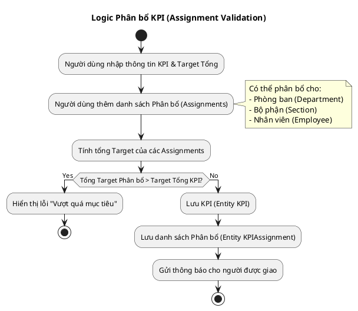
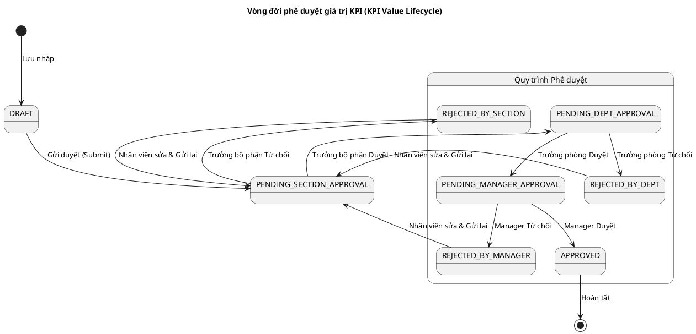
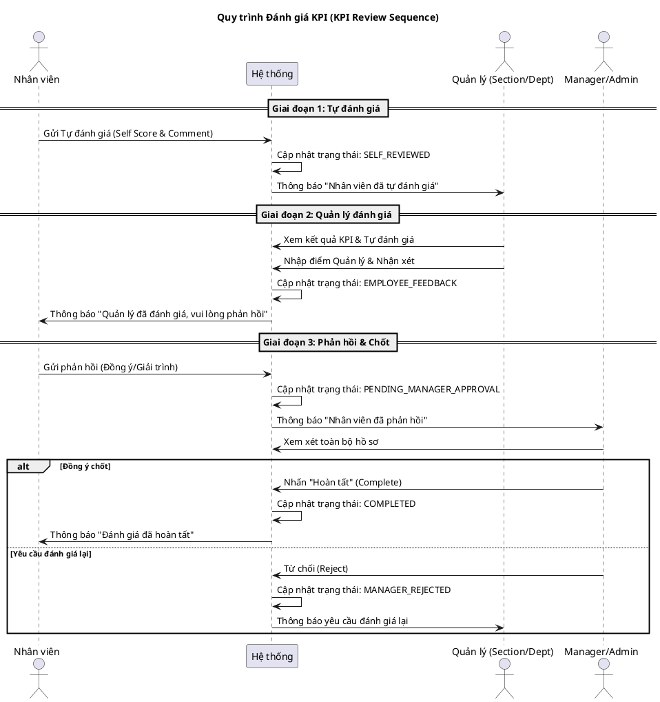

# TÀI LIỆU BASIC DESIGN THỐNG QUẢN LÝ KPI (IVC)
Hệ thống này tập trung vào việc quản lý KPI theo mô hình phân cấp (Công ty -> Phòng ban -> Bộ phận -> Nhân viên) với quy trình phê duyệt và đánh giá chặt chẽ.

Dưới đây là tài liệu đặc tả Gherkin cho các luồng nghiệp vụ chính, kèm theo biểu đồ PlantUML để minh họa logic.

---

### 1. Feature: Thiết lập và Phân bổ KPI (KPI Setup & Assignment)

Luồng này mô tả việc tạo KPI cấp cao và phân bổ chỉ tiêu xuống các cấp thấp hơn. Logic quan trọng nằm ở việc kiểm tra tổng chỉ tiêu được giao không vượt quá chỉ tiêu tổng.

**File liên quan:** `kpis.service.ts`, `KpiCreateCompany.vue`, `CompanyAssignmentModals.vue`

```gherkin
Feature: Thiết lập và Phân bổ KPI

  Background:
    Given Người dùng đăng nhập với vai trò "Admin" hoặc "Manager"
    And Hệ thống đã có danh sách Phòng ban và Nhân viên

  Scenario: Tạo KPI cấp Công ty và phân bổ cho Phòng ban
    Given Người dùng đang ở trang "Tạo KPI Công ty"
    When Người dùng nhập thông tin KPI:
      | Tên KPI       | Doanh thu Q1/2025 |
      | Mục tiêu tổng | 10,000,000,000    |
      | Đơn vị        | VND               |
      | Tần suất      | Hàng quý          |
    And Người dùng chọn phân bổ cho các Phòng ban:
      | Phòng ban      | Mục tiêu giao |
      | Phòng Kinh doanh| 6,000,000,000 |
      | Phòng Marketing | 4,000,000,000 |
    And Người dùng nhấn "Lưu"
    Then Hệ thống kiểm tra tổng mục tiêu phân bổ (10 tỷ) bằng mục tiêu tổng (10 tỷ)
    And Hệ thống lưu KPI mới với trạng thái "DRAFT" hoặc "APPROVED" tùy quyền hạn
    And Hệ thống tạo các bản ghi "KPI Assignment" tương ứng cho từng phòng ban

  Scenario: Hệ thống ngăn chặn phân bổ vượt quá mục tiêu
    Given Người dùng đang sửa phân bổ cho KPI "Doanh thu Q1/2025" (Mục tiêu: 10 tỷ)
    When Người dùng nhập mục tiêu cho "Phòng Kinh doanh" là 11,000,000,000
    And Người dùng nhấn "Lưu"
    Then Hệ thống hiển thị lỗi "Tổng mục tiêu đã giao vượt quá mục tiêu KPI"
    And Dữ liệu không được lưu
```

**Biểu đồ Logic Phân bổ (PlantUML):**



---

### 2. Feature: Cập nhật Kết quả & Phê duyệt (Progress Update & Approval)

Đây là luồng hoạt động hàng ngày. Nhân viên cập nhật kết quả, và hệ thống yêu cầu phê duyệt theo cấp bậc (Section -> Dept -> Manager).

**File liên quan:** `kpi-values.service.ts`, `KpiValueApprovalList.vue`, `KpiPersonal.vue`

```gherkin
Feature: Cập nhật tiến độ và Phê duyệt kết quả KPI

  Background:
    Given Nhân viên "NV_A" thuộc "Bộ phận Sales 1"
    And "NV_A" đã được giao KPI "Doanh số cá nhân"

  Scenario: Nhân viên gửi kết quả thực tế (Submit Actual Value)
    Given "NV_A" đang ở trang "KPI Cá nhân"
    When "NV_A" chọn KPI "Doanh số cá nhân" và nhấn "Cập nhật tiến độ"
    And "NV_A" nhập:
      | Giá trị thực tế | 500,000,000 |
      | Ghi chú         | Đã chốt hợp đồng X |
      | Minh chứng      | file_hop_dong.pdf  |
    And Nhấn "Gửi phê duyệt"
    Then Hệ thống tạo bản ghi "KpiValue" với trạng thái "PENDING_SECTION_APPROVAL"
    And Trưởng bộ phận nhận được thông báo phê duyệt

  Scenario: Quy trình phê duyệt đa cấp (Multi-level Approval)
    Given Có một yêu cầu cập nhật KPI ở trạng thái "PENDING_SECTION_APPROVAL"
    
    When "Trưởng bộ phận" phê duyệt
    Then Trạng thái chuyển sang "PENDING_DEPT_APPROVAL"
    And "Trưởng phòng" nhận được thông báo
    
    When "Trưởng phòng" phê duyệt
    Then Trạng thái chuyển sang "PENDING_MANAGER_APPROVAL"
    And "Manager/Admin" nhận được thông báo
    
    When "Manager" phê duyệt
    Then Trạng thái chuyển sang "APPROVED"
    And Giá trị thực tế của KPI được cập nhật chính thức
    And Điểm hiệu suất được tính toán lại
```

**Biểu đồ Trạng thái Phê duyệt (PlantUML):**



---

### 3. Feature: Đánh giá Hiệu suất Cuối kỳ (Performance Review)

Luồng này diễn ra vào cuối chu kỳ (Quý/Năm). Nó bao gồm tự đánh giá, đánh giá của quản lý và phản hồi.

**File liên quan:** `kpi-review.service.ts`, `MyKpiSelfReview.vue`, `ReviewFormModal.vue`

```gherkin
Feature: Đánh giá Hiệu suất KPI (KPI Review)

  Background:
    Given Chu kỳ đánh giá "Q1/2025" đang mở
    And KPI "Doanh số" của nhân viên đã có kết quả thực tế được duyệt

  Scenario: Quy trình đánh giá đầy đủ (Full Review Cycle)
    # Bước 1: Tự đánh giá
    Given Nhân viên đang ở trang "Tự đánh giá KPI"
    When Nhân viên nhập điểm tự đánh giá (4/5) và nhận xét
    And Nhấn "Gửi đánh giá"
    Then Trạng thái Review chuyển thành "SELF_REVIEWED"

    # Bước 2: Quản lý đánh giá
    When Quản lý (Section/Dept/Manager) mở form đánh giá nhân viên
    And Quản lý nhập điểm đánh giá (3.5/5) và nhận xét
    And Nhấn "Gửi phản hồi cho nhân viên"
    Then Trạng thái Review chuyển thành "EMPLOYEE_FEEDBACK"
    And Nhân viên nhận được thông báo

    # Bước 3: Phản hồi và Chốt
    When Nhân viên xem đánh giá và nhập phản hồi "Đồng ý với đánh giá"
    And Nhấn "Gửi lại cho quản lý"
    Then Trạng thái Review chuyển thành "PENDING_MANAGER_APPROVAL"
    
    When Manager xem xét phản hồi và nhấn "Hoàn tất"
    Then Trạng thái Review chuyển thành "COMPLETED"
    And Điểm số cuối cùng được ghi nhận vào hồ sơ nhân viên
```

**Biểu đồ Tuần tự Đánh giá (PlantUML):**



### 4. Tóm tắt các điểm then chốt (Key Logic Points)

Dựa trên mã nguồn, đây là các logic quan trọng cần lưu ý khi kiểm thử hoặc phát triển tiếp:

1.  **Quyền hạn (RBAC):** Hệ thống sử dụng `userHasPermission` rất nhiều. Việc hiển thị nút bấm và cho phép gọi API phụ thuộc chặt chẽ vào `action`, `resource`, và `scope` (ví dụ: `approve:kpi-value:section`).
2.  **Validation Phân bổ:** Khi phân bổ KPI từ Công ty -> Phòng ban -> Bộ phận -> Nhân viên, hệ thống luôn kiểm tra tổng target cấp con $\le$ target cấp cha (hoặc bằng, tùy cấu hình).
3.  **Trạng thái KPI Value:** Một giá trị thực tế (Actual Value) không được tính vào tiến độ cho đến khi nó đạt trạng thái `APPROVED`.
4.  **Tính toán Công thức:** Hệ thống sử dụng thư viện `mathjs` để tính toán giá trị KPI dựa trên công thức động (được định nghĩa trong `KpiFormula`).
5.  **Chu kỳ (Cycle):** Mọi đánh giá đều gắn liền với một `ReviewCycle`. Nếu KPI không nằm trong khoảng thời gian của Cycle, nó có thể không xuất hiện trong đợt đánh giá.
