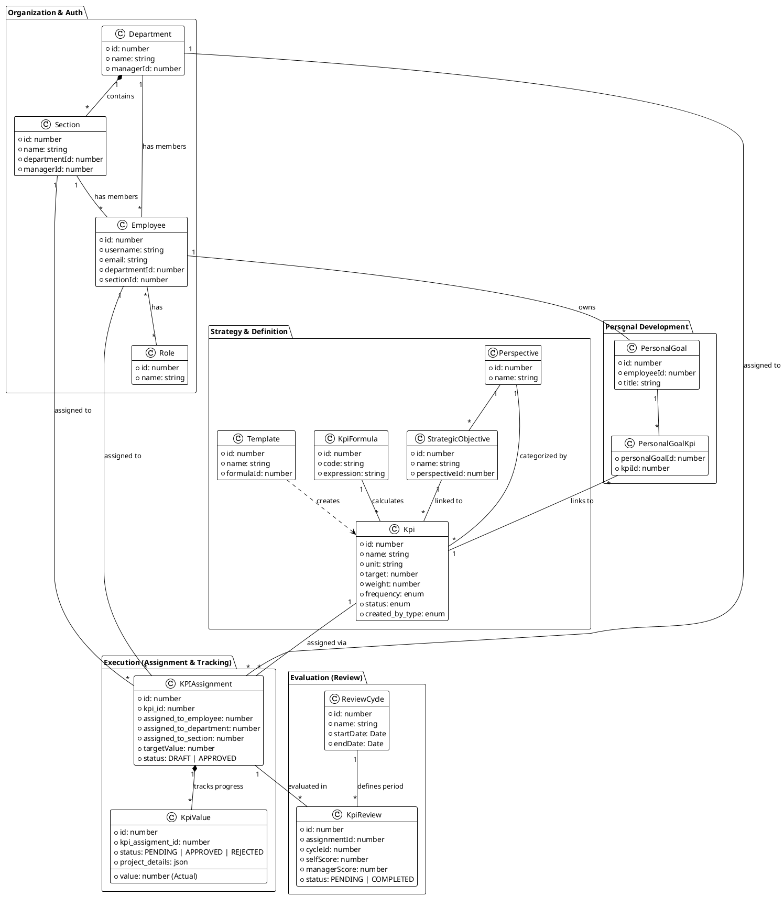

# TÀI LIỆU DESIGN DETAIL HỆ THỐNG QUẢN LÝ KPI (IVC)
Các Domain Entities, Aggregates và xây dựng sơ đồ UML thể hiện kiến trúc logic của hệ thống KPI.

### 1. Domain Entities & Aggregates

Hệ thống được chia thành các cụm (Aggregates) chính sau đây để quản lý sự phức tạp của nghiệp vụ:

#### A. Organization Aggregate (Cơ cấu tổ chức)
Cụm này quản lý cấu trúc nhân sự và phân quyền.
*   **Department (Root):** Phòng ban lớn. Chứa danh sách nhân viên và các Section con. Có người quản lý (Manager).
*   **Section:** Bộ phận nhỏ thuộc Department. Có người quản lý (Leader).
*   **Team:** Nhóm nhỏ thuộc Section.
*   **Employee:** Nhân viên. Thuộc về một Dept/Section/Team cụ thể. Có vai trò (Roles) và quyền hạn (Permissions).
*   **Role & Permission:** Hệ thống RBAC (Role-Based Access Control) để quản lý quyền truy cập.

#### B. Strategy Aggregate (Chiến lược)
Định nghĩa các mục tiêu cấp cao theo mô hình BSC (Balanced Scorecard).
*   **Perspective (Root):** Các viễn cảnh (Tài chính, Khách hàng, Quy trình nội bộ, Học hỏi & Phát triển).
*   **StrategicObjective:** Mục tiêu chiến lược cụ thể, thuộc về một Perspective.

#### C. KPI Definition Aggregate (Định nghĩa KPI)
Định nghĩa "cái gì" cần đo lường.
*   **Kpi (Root):** Định nghĩa chỉ số KPI. Chứa thông tin về tên, công thức, tần suất, trọng số, đơn vị tính.
    *   *Logic:* KPI có thể được tạo ở cấp Công ty, Phòng ban hoặc Cá nhân.
*   **KpiFormula:** Công thức tính toán kết quả (ví dụ: `(Thực tế / Mục tiêu) * 100`).
*   **Template:** Mẫu KPI để tái sử dụng, giúp tạo nhanh KPI mới.

#### D. KPI Execution Aggregate (Thực thi KPI)
Đây là cụm quan trọng nhất, xử lý việc giao chỉ tiêu và ghi nhận kết quả hàng ngày/tháng.
*   **KPIAssignment (Root):** Bản ghi phân công một `Kpi` cho một đối tượng cụ thể (Employee, Department, hoặc Section).
    *   *Attributes:* `targetValue` (Mục tiêu cụ thể cho người được giao), `status` (Draft/Approved).
*   **KpiValue:** Giá trị thực tế (Actual Value) được nhập vào cho một `KPIAssignment`.
    *   *Logic:* Một Assignment có thể có nhiều Value (lịch sử cập nhật). Value có quy trình duyệt (Pending -> Approved/Rejected).
*   **KpiValueHistory:** Lịch sử thay đổi của KpiValue (Audit trail).

#### E. Evaluation Aggregate (Đánh giá & Xếp hạng)
Xử lý quy trình đánh giá định kỳ (Review) dựa trên kết quả thực thi.
*   **ReviewCycle (Root):** Chu kỳ đánh giá (ví dụ: Quý 1/2025).
*   **KpiReview:** Bản ghi đánh giá kết quả của một `KPIAssignment` trong một `ReviewCycle`.
    *   *Logic:* Chứa điểm tự đánh giá (Self Score), điểm quản lý (Manager Score), và các cấp duyệt (Section/Dept).

#### F. Personal Development Aggregate
*   **PersonalGoal:** Mục tiêu cá nhân của nhân viên, có thể liên kết với KPI.
*   **Competency & EmployeeSkill:** Quản lý năng lực và kỹ năng của nhân viên.

---

### 2. Sơ đồ UML Class Diagram (PlantUML)

Sơ đồ dưới đây thể hiện các lớp thực thể chính và mối quan hệ giữa chúng, tập trung vào luồng dữ liệu từ Tổ chức -> Định nghĩa KPI -> Giao chỉ tiêu -> Thực thi -> Đánh giá.

### 3. Phân tích Luồng Logic Chính

Dựa trên mã nguồn, đây là các luồng nghiệp vụ then chốt:

1.  **Quy trình Tạo & Giao KPI (Assignment Flow):**
    *   Người dùng (Admin/Manager) tạo `Kpi` (có thể từ `Template` hoặc mới).
    *   Hệ thống tạo ra các bản ghi `KPIAssignment`.
        *   Nếu giao cho Phòng ban (`assigned_to_department`), mục tiêu (`targetValue`) được gán cho phòng ban đó.
        *   Nếu giao cho Nhân viên (`assigned_to_employee`), mục tiêu cá nhân được thiết lập.
    *   Có logic kiểm tra (Validation): Tổng target của các cấp con không được vượt quá target của cấp cha (ví dụ: Tổng target nhân viên <= Target của Section).

2.  **Quy trình Cập nhật Tiến độ (Submission Flow):**
    *   Nhân viên chọn `KPIAssignment` của mình.
    *   Nhân viên nhập kết quả thực tế -> Tạo bản ghi `KpiValue` với trạng thái `SUBMITTED` hoặc `DRAFT`.
    *   Nếu là `SUBMITTED`, trạng thái chuyển sang `PENDING_..._APPROVAL` tùy theo cấp bậc người gửi (Section/Dept/Manager).

3.  **Quy trình Phê duyệt (Approval Flow):**
    *   `KpiValue` đi qua các cấp phê duyệt:
        *   Section Leader -> Department Manager -> Senior Manager/Admin.
    *   Tại mỗi cấp, người duyệt có thể `APPROVE` (chuyển lên cấp trên hoặc hoàn tất) hoặc `REJECT` (trả về cho nhân viên sửa).
    *   Khi `KpiValue` có trạng thái `APPROVED`, nó được tính vào kết quả thực tế (`actual_value`) của KPI.

4.  **Quy trình Đánh giá (Review Flow):**
    *   Dựa trên `ReviewCycle` (ví dụ: Quý 1).
    *   Hệ thống tạo `KpiReview` liên kết với `KPIAssignment`.
    *   Nhân viên tự đánh giá (`selfScore`).
    *   Quản lý các cấp đánh giá lại (`sectionScore`, `departmentScore`, `managerScore`).
    *   Điểm cuối cùng được chốt khi trạng thái là `COMPLETED`.

5.  **Tính toán & Báo cáo:**
    *   Hệ thống sử dụng `KpiFormula` (sử dụng thư viện `mathjs`) để tính toán phần trăm hoàn thành dựa trên `Actual` (từ KpiValue đã duyệt) và `Target` (từ KPIAssignment).
    *   Dữ liệu được tổng hợp lên Dashboard (Performance Overview, Inventory, v.v.).
