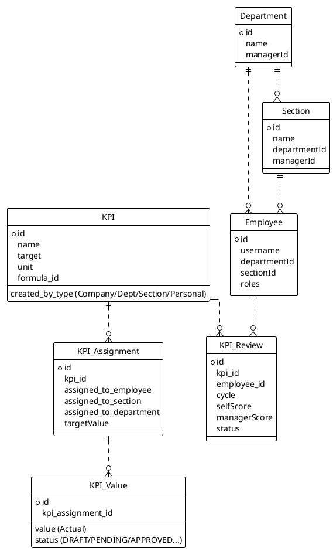
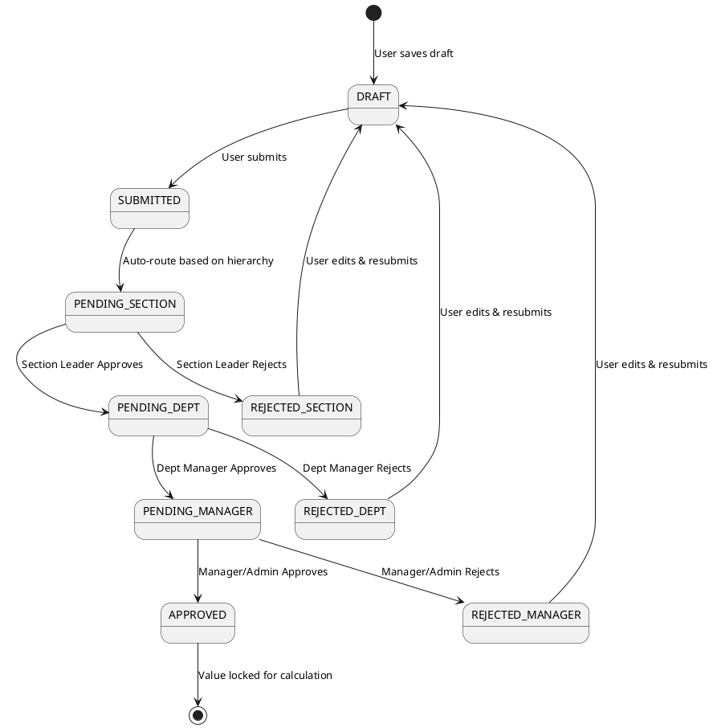
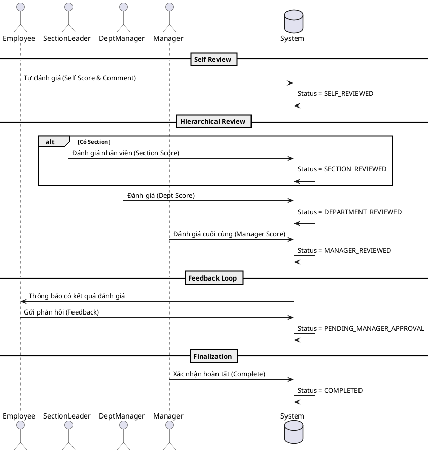

# TÀI LIỆU ĐẶC TẢ HỆ THỐNG QUẢN LÝ KPI (IVC)

## 1. TỔNG QUAN KIẾN TRÚC (SYSTEM OVERVIEW)

Hệ thống được thiết kế theo mô hình Client-Server với kiến trúc phân lớp:
*   **Frontend:** Vue 3, Vuex (State Management), Ant Design Vue (UI), Chart.js (Visualization).
*   **Backend:** NestJS, TypeORM (PostgreSQL), Socket.IO (Real-time notifications).
*   **Security:** JWT Authentication, Session Management (Database-backed), RBAC (Role-Based Access Control) với Scope (Phạm vi).

### Sơ đồ thực thể chính (Entity Relationship - Simplified)

---

## 2. PHÂN HỆ QUẢN TRỊ & BẢO MẬT (ADMIN & SECURITY)

### 2.1. Cơ chế Phân quyền (RBAC)
Hệ thống sử dụng cơ chế phân quyền động dựa trên **Action**, **Resource** và **Scope**.
*   **Action:** `view`, `create`, `update`, `delete`, `approve`, `reject`, `assign`.
*   **Resource:** `kpi`, `kpi-value`, `kpi-review`, `employee`, `report`, `dashboard`.
*   **Scope:**
    *   `global`: Toàn hệ thống (Admin).
    *   `company`: Cấp công ty.
    *   `department`: Chỉ dữ liệu trong phòng ban của user.
    *   `section`: Chỉ dữ liệu trong bộ phận (nhóm) của user.
    *   `employee` / `personal`: Chỉ dữ liệu cá nhân.

### 2.2. Quản lý Phiên (Session Management)
*   **Logic:** Mỗi khi đăng nhập, một `sessionId` được tạo và lưu vào JWT payload + Database (`user_sessions`).
*   **Concurrent Login:** Hệ thống kiểm soát đăng nhập đồng thời. Nếu phát hiện session cũ không hợp lệ hoặc bị đăng xuất từ xa, user sẽ bị logout.

---

## 3. QUẢN LÝ KPI (KPI MANAGEMENT)

### 3.1. Các loại KPI & Cấp độ
KPI được phân loại theo cấp độ tạo (`created_by_type`):
1.  **Company KPI:** KPI chiến lược toàn công ty. Được giao xuống cho các Department.
2.  **Department KPI:** KPI của phòng ban. Được giao xuống cho các Section hoặc trực tiếp cho Employee.
3.  **Section KPI:** KPI của bộ phận. Được giao xuống cho Employee.
4.  **Personal KPI:** KPI cá nhân tự thiết lập.

### 3.2. Quy trình Phân bổ (Assignment Flow)
Đây là tính năng cốt lõi để "cascading" mục tiêu từ trên xuống dưới.

**Logic Validate:**
*   Tổng `target` được giao cho cấp dưới không được vượt quá `target` của cấp trên (hoặc KPI gốc).
*   Ví dụ: KPI Công ty (Target 100) -> Giao cho Dept A (30), Dept B (70). Dept A giao cho User 1 (10), User 2 (20).

**API Endpoints:**
*   `POST /kpis`: Tạo KPI mới kèm thông tin phân bổ ban đầu.
*   `POST /kpis/:id/assignments`: Giao KPI cho nhân viên (User Assignment).
*   `POST /kpis/:id/sections/assignments`: Giao KPI cho Department/Section.

### 3.3. Công thức tính (Formulas)
Hệ thống hỗ trợ công thức động sử dụng thư viện `mathjs`.
*   **Variables:** `values` (mảng thực đạt), `targets` (mảng mục tiêu), `target` (mục tiêu tổng), `weight`.
*   **Functions:** `sum()`, `average()`, `min()`, `max()`.
*   **Ví dụ:** `(sum(values)/target)*100` (Tính % hoàn thành dựa trên tổng thực đạt so với mục tiêu).

---

## 4. QUY TRÌNH CẬP NHẬT KẾT QUẢ & PHÊ DUYỆT (KPI VALUE SUBMISSION)

Quy trình này xử lý việc nhân viên nhập kết quả thực tế (`Actual Value`) và các cấp quản lý phê duyệt con số đó.

### 4.1. Luồng trạng thái (State Diagram)

### 4.2. Logic Nghiệp vụ
1.  **Submit:** Nhân viên nhập số liệu, đính kèm minh chứng (Project Details).
2.  **Approval Chain:**
    *   Nếu nhân viên thuộc Section -> Cần Section Leader duyệt.
    *   Sau đó -> Cần Department Manager duyệt.
    *   Cuối cùng -> Cần Manager/Admin duyệt (Final Approval).
    *   *Lưu ý:* Nếu người submit là Manager, hệ thống có thể tự động duyệt các cấp thấp hơn.
3.  **Correction:** Cấp duyệt có thể sửa trực tiếp giá trị (`corrected_value`) và ghi chú lý do thay vì từ chối trả về.

**API Endpoints:**
*   `POST /kpi-values/assignments/:id/updates`: Submit kết quả.
*   `POST /kpi-values/:id/approve-section`: Section duyệt.
*   `POST /kpi-values/:id/approve-department`: Dept duyệt.
*   `POST /kpi-values/:id/approve-manager`: Manager duyệt (Final).
*   `POST /kpi-values/:id/reject-*`: Từ chối (kèm lý do).

---

## 5. QUY TRÌNH ĐÁNH GIÁ HIỆU SUẤT (PERFORMANCE REVIEW)

Quy trình này diễn ra theo chu kỳ (Cycle - ví dụ: Quý 1/2024), đánh giá dựa trên điểm số (`Score`) và nhận xét (`Comment`), không chỉ dựa trên con số thực đạt.

### 5.1. Luồng đánh giá (Sequence Diagram)

### 5.2. Logic Tính điểm
*   **Score:** Thang điểm 1-5.
*   **Weight:** Trọng số của KPI.
*   **Total Score:** Tổng (Score * Weight) của tất cả KPI trong chu kỳ.
*   **Fallback:** Nếu cấp trên không chấm điểm, hệ thống có thể cấu hình lấy điểm của cấp dưới hoặc điểm tự đánh giá (tùy policy).

**API Endpoints:**
*   `GET /kpi-review`: Lấy danh sách đánh giá.
*   `POST /kpi-review/my/self-review`: Nhân viên tự đánh giá.
*   `POST /kpi-review/submit-review`: Cấp quản lý chấm điểm.
*   `POST /kpi-review/employee-feedback`: Nhân viên phản hồi.
*   `POST /kpi-review/complete-review`: Chốt đánh giá.

---

## 6. BÁO CÁO & DASHBOARD

### 6.1. Dashboard
*   **KPI Process Stats:** Thống kê số lượng KPI đang chờ duyệt, thời gian duyệt trung bình.
*   **Performance Overview:** Biểu đồ Pie/Bar thể hiện tỷ lệ đạt/không đạt KPI.
*   **Inventory:** Tổng số lượng KPI, phân bổ theo phòng ban.
*   **User Activity:** Top user submit nhiều nhất/ít nhất.

### 6.2. Report Generator
Hệ thống cho phép xuất báo cáo ra Excel/PDF với các tiêu chí lọc:
*   Loại báo cáo: Summary, Details, Comparison, Employee Performance.
*   Thời gian: Date Range.
*   Định dạng: `.xlsx`, `.pdf`.

**API Endpoint:**
*   `GET /reports/generate`: Stream file binary về client.

---

## 7. CÁC TÍNH NĂNG KHÁC

### 7.1. Strategic Objectives (Mục tiêu chiến lược)
*   Quản lý các mục tiêu dài hạn (BSC Perspectives: Tài chính, Khách hàng, Quy trình, Học hỏi).
*   Liên kết KPI với Mục tiêu chiến lược để tính toán tiến độ (`Progress`) của mục tiêu dựa trên KPI con.

### 7.2. Personal Goals
*   Cho phép nhân viên tạo mục tiêu cá nhân (ngoài KPI bắt buộc).
*   Có thể liên kết (`Link`) mục tiêu cá nhân với một KPI hệ thống để tự động cập nhật tiến độ.

### 7.3. Notifications (Real-time)
*   Sử dụng **Socket.IO** (`NotificationGateway`).
*   Các sự kiện kích hoạt: Giao KPI mới, Submit kết quả, Duyệt/Từ chối, Yêu cầu phản hồi đánh giá.
*   UI: Chuông thông báo trên Header, cập nhật số lượng chưa đọc realtime.

---

## 8. UI FLOWS (MÔ TẢ GIAO DIỆN CHÍNH)

### 8.1. Màn hình "My Assigned KPIs" (`KpiPersonal.vue`)
1.  **Load:** Gọi API lấy danh sách KPI được giao cho user hiện tại.
2.  **Group:** Nhóm KPI theo Viễn cảnh (Perspective).
3.  **Action:**
    *   Nút "Update Progress": Mở modal nhập liệu (`SubmitUpdateModal`).
    *   Nút "History": Xem lịch sử thay đổi giá trị.
    *   Checkbox: Chọn nhiều KPI để "Batch Submit".

### 8.2. Màn hình "Approvals" (`KpiValueApprovalList.vue`)
1.  **Filter:** Lọc theo nhân viên, phòng ban.
2.  **View:** Hiển thị danh sách KPI Values đang ở trạng thái `PENDING` tương ứng với quyền của user (VD: Section Leader chỉ thấy Pending Section).
3.  **Action:**
    *   Approve: Chuyển trạng thái lên cấp tiếp theo.
    *   Reject: Nhập lý do, chuyển trạng thái về Rejected.
    *   Edit: Sửa giá trị thực tế (Correction) trước khi duyệt.

### 8.3. Màn hình "KPI Review" (`KpiReviewList.vue`)
1.  **Cycle Selection:** Chọn chu kỳ đánh giá (VD: Q1 2024).
2.  **Table:** Danh sách nhân viên cần đánh giá.
3.  **Modal Review:**
    *   Hiển thị các bước (Stepper): Self -> Section -> Dept -> Manager.
    *   Form nhập điểm và nhận xét cho từng KPI.
    *   Tính năng "Batch Approve" cho phép duyệt nhanh nhiều nhân viên nếu họ đạt yêu cầu.

---
*Tài liệu này được xây dựng dựa trên phân tích mã nguồn thực tế của dự án IVC KPI System.*
