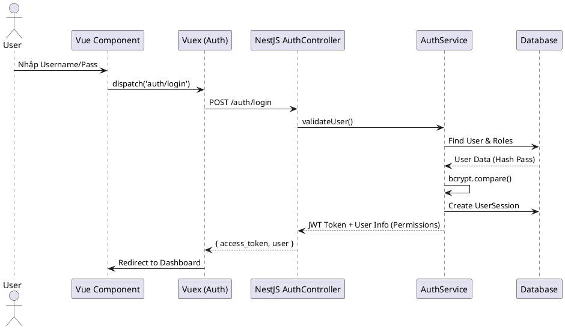
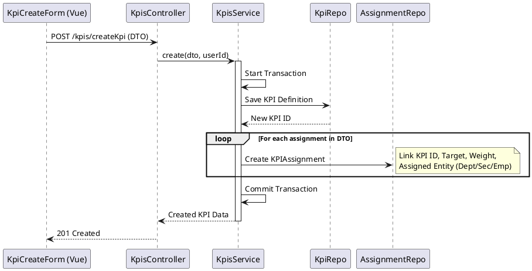
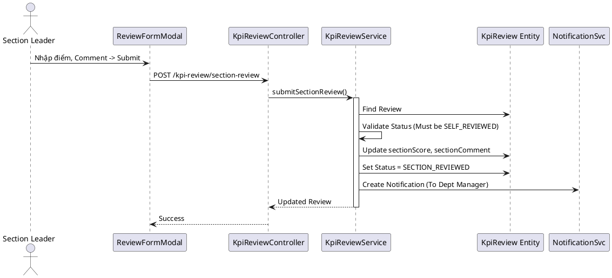
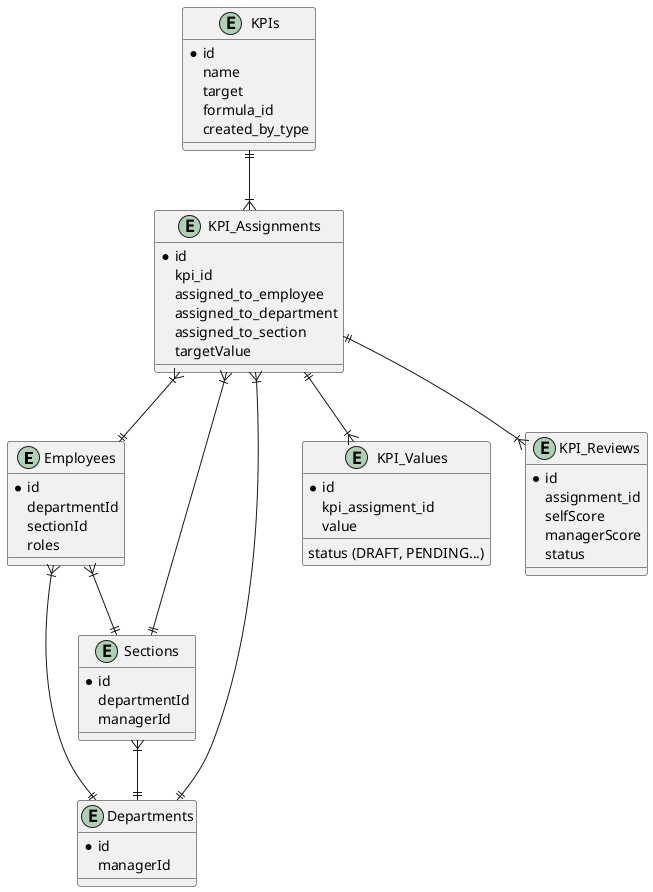

# PHÂN TÍCH KIẾN TRÚC HỆ THỐNG KPI FULLSTACK

## 1. Tổng quan Kiến trúc (High-Level Architecture)

Hệ thống tuân theo mô hình **Client-Server** tiêu chuẩn với kiến trúc phân lớp (Layered Architecture):

*   **Frontend (Client):** Vue.js 3 (Composition API) sử dụng Vuex để quản lý trạng thái (State Management) và Ant Design Vue cho UI. Giao tiếp với Backend qua RESTful API (Axios).
*   **Backend (Server):** NestJS framework. Sử dụng TypeORM để tương tác với cơ sở dữ liệu. Kiến trúc module hóa cao (Controller - Service - Repository).
*   **Database:** PostgreSQL (dựa trên cấu hình TypeORM).
*   **Real-time:** Sử dụng Socket.IO để đẩy thông báo (Notification) tức thời.

---

## 2. Luồng Xác thực & Phân quyền (Authentication & RBAC)

Hệ thống sử dụng JWT (JSON Web Token) để xác thực và cơ chế RBAC (Role-Based Access Control) động để phân quyền.

### Luồng xử lý:
1.  **Login:**
    *   **FE:** `LoginPage.vue` gọi action `auth/login`.
    *   **BE:** `AuthService` kiểm tra username/password (bcrypt). Nếu đúng, tạo `UserSession` và trả về `access_token` chứa `userId`, `sessionId`, `roles`.
    *   **FE:** Lưu token vào LocalStorage/SessionStorage và Axios Interceptor tự động đính kèm token vào mọi request sau đó.

2.  **Phân quyền (Authorization):**
    *   **BE:** Sử dụng `PermissionGuard` và Decorator `@Permission(action, resource, scope)`. Guard sẽ lấy user từ request, query bảng `permissions` (thông qua `roles`) để kiểm tra xem user có quyền thực hiện hành động trên tài nguyên đó không.
    *   **FE:** Hàm `hasPermission` trong `AppSidebar.vue` và các component khác kiểm tra danh sách permissions được trả về trong object `user` để ẩn/hiện menu hoặc nút bấm.

---

## 3. Luồng Nghiệp vụ: Tạo và Giao KPI (KPI Creation & Assignment)

Đây là luồng phức tạp nhất, xử lý việc định nghĩa KPI và phân bổ xuống các cấp (Công ty -> Phòng ban -> Bộ phận -> Nhân viên).

### Logic Frontend (`KpiCreateCompany.vue` / `KpiCreateSection.vue`):
1.  Người dùng nhập thông tin KPI (Tên, Công thức, Chu kỳ, Target...).
2.  Người dùng chọn đối tượng được giao (Assignments) thông qua `rowSelection` trên bảng hoặc Dropdown.
3.  **Validation:** FE kiểm tra tổng Target được giao có vượt quá Target của KPI cha không (`validateDepartmentTotalAgainstKpi`, `validateSectionTotalAgainstDepartment`).
4.  Gửi payload chứa thông tin KPI và object `assignments` (to_departments, to_sections, to_employees) xuống BE.

### Logic Backend (`KpisService.ts`):
1.  **Transaction:** Bắt đầu transaction database.
2.  **Lưu KPI:** Tạo bản ghi vào bảng `kpis`. Trạng thái mặc định là `DRAFT` hoặc `APPROVED` tùy quyền người tạo.
3.  **Xử lý Assignment:**
    *   Dựa vào payload `assignments`, Service sẽ tạo các bản ghi vào bảng `kpi_assignment`.
    *   **Soft Delete & Restore:** Nếu assignment đã tồn tại (nhưng bị soft-delete trước đó), hệ thống sẽ khôi phục lại thay vì tạo mới để giữ lịch sử.
    *   Mapping dữ liệu: `assigned_to_department`, `assigned_to_section`, `assigned_to_employee` được set tương ứng.

---

## 4. Luồng Nghiệp vụ: Cập nhật Kết quả (KPI Value Submission)

Nhân viên hoặc quản lý cập nhật kết quả thực hiện (Actual Value) cho KPI.

### Logic Frontend (`KpiPersonal.vue`):
1.  Người dùng nhập giá trị thực tế (hoặc các mục con trong `project_details`).
2.  Gọi API `submitProgressUpdate` hoặc `saveDraftProgressUpdate`.

### Logic Backend (`KpiValuesService.ts`):
1.  **Validation:** Kiểm tra KPI có đang `APPROVED` không, có hết hạn (`expired`) không.
2.  **Tính toán:** Cộng tổng giá trị từ `project_details` nếu có.
3.  **Workflow Trạng thái (State Machine):**
    *   Xác định trạng thái tiếp theo dựa trên quyền của người submit (`userHasPermission`).
    *   Ví dụ: Nhân viên submit -> `PENDING_SECTION_APPROVAL`. Trưởng bộ phận submit -> `PENDING_DEPT_APPROVAL`.
4.  **Lưu trữ:**
    *   Cập nhật/Tạo mới bản ghi trong bảng `kpi_values`.
    *   Ghi log vào bảng `kpi_value_history` (Audit trail).
5.  **Sự kiện (Event Emitter):**
    *   Bắn event (ví dụ: `kpi_value.submitted_for_section_approval`).
    *   `NotificationListener` lắng nghe event này và tạo thông báo (`NotificationService`) + đẩy Socket cho người duyệt.

---

## 5. Luồng Nghiệp vụ: Đánh giá & Phê duyệt (Review & Approval)

Hệ thống hỗ trợ quy trình đánh giá nhiều cấp: Tự đánh giá -> Section -> Department -> Manager.

### Logic Frontend (`KpiReviewList.vue`, `ReviewFormModal.vue`):
1.  Hiển thị danh sách cần duyệt dựa trên quyền (`canApproveSection`, `canApproveManager`...).
2.  Modal đánh giá hiển thị các bước (Steps) và cho phép nhập điểm/comment tương ứng với cấp độ.

### Logic Backend (`KpiReviewService.ts`):
1.  **Lấy dữ liệu:** `getKpiReviews` lọc theo quyền. Manager thấy tất cả, Section chỉ thấy nhân viên thuộc Section.
2.  **Submit Review (`submitSectionReview`, `submitManagerReview`...):**
    *   Kiểm tra trạng thái hiện tại (ví dụ: Section chỉ được review khi trạng thái là `SELF_REVIEWED`).
    *   Cập nhật điểm số (`sectionScore`, `managerScore`...) vào bảng `kpi_review`.
    *   Cập nhật trạng thái review (ví dụ: `SECTION_REVIEWED`).
    *   Ghi lịch sử vào `kpi_review_history`.
3.  **Fallback Logic (Điểm số):**
    *   Hàm `getScoreWithFallback`: Nếu cấp trên không nhập điểm, hệ thống có thể lấy điểm của cấp dưới làm mặc định (Manager Score = Department Score nếu Manager không sửa).
4.  **Batch Approve:**
    *   Cho phép duyệt hàng loạt. Hệ thống lặp qua danh sách, áp dụng logic duyệt cho từng item và trả về kết quả thành công/thất bại.

---

## 6. Sơ đồ ERD Rút gọn (Key Entities)

Mô tả mối quan hệ giữa các bảng chính trong Database để hiểu cách dữ liệu liên kết.

## 7. Điểm Nhấn Kỹ Thuật (Technical Highlights)

1.  **Dynamic Permission (RBAC):** Hệ thống không hardcode quyền (như `if (role == 'admin')`). Thay vào đó, nó kiểm tra `hasPermission(action, resource, scope)`. Điều này cho phép cấu hình quyền động trong DB (`RolePermissionManager.vue`).
2.  **Data Consistency:** Khi tạo KPI, Backend sử dụng Transaction để đảm bảo KPI và các Assignments được tạo đồng thời hoặc rollback nếu lỗi.
3.  **Hierarchical Aggregation:** Trong `KpisService.findAll`, hệ thống tính toán giá trị thực tế (`actual_value`) bằng cách tổng hợp từ dưới lên (Employee -> Section -> Department) để hiển thị tiến độ chính xác ở các cấp cao hơn.
4.  **Audit Logging:** Mọi thay đổi quan trọng (Submit value, Approve, Reject) đều được ghi vào bảng History (`kpi_value_history`, `kpi_review_history`) để truy vết.
