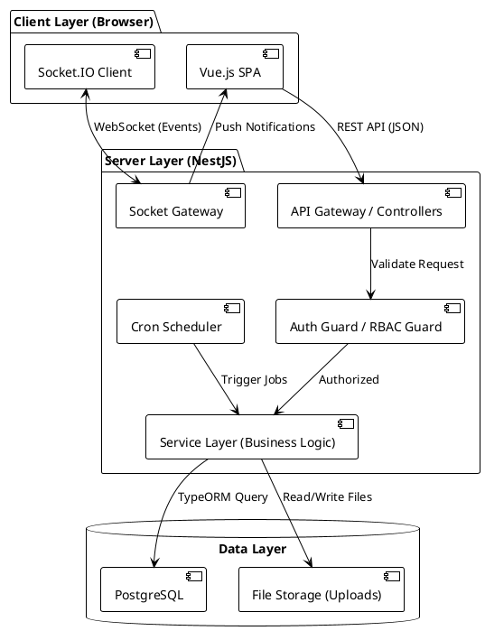
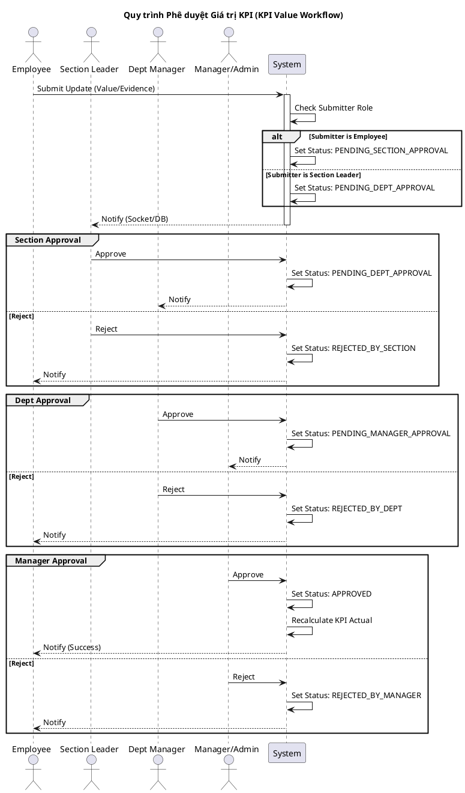

# TÀI LIỆU KIẾN TRÚC & TRIỂN KHAI HỆ THỐNG KPI IVC

## 1. Technology Stack (Công nghệ sử dụng)

Hệ thống được xây dựng theo mô hình **Client-Server** tách biệt (Headless architecture), giao tiếp qua RESTful API và WebSocket.

### 1.1. Frontend (`kpi-frontend`)
*   **Core Framework:** Vue.js 3 (Composition API, `<script setup>`).
*   **State Management:** Vuex 4 (Quản lý trạng thái tập trung cho Auth, KPIs, Notifications, Reports...).
*   **Routing:** Vue Router 4.
*   **UI Component Library:** Ant Design Vue (Hệ thống UI chính).
*   **HTTP Client:** Axios (Cấu hình Interceptor xử lý Token và Error global).
*   **Real-time:** Socket.IO Client (Nhận thông báo tức thời).
*   **Charts/Visualization:** Vue-Chartjs, ApexCharts.
*   **Utilities:** Dayjs (Xử lý thời gian), Lodash, ExcelJS (Export báo cáo), v-md-editor (Markdown editor).
*   **Internationalization:** Vue I18n (Hỗ trợ đa ngôn ngữ: EN, VI, JA).

### 1.2. Backend (`kpi-backend`)
*   **Core Framework:** NestJS (Node.js framework kiến trúc module).
*   **Language:** TypeScript.
*   **Database ORM:** TypeORM.
*   **Database:** PostgreSQL (Dựa trên cấu hình `type: 'postgres'` trong `app.module.ts`).
*   **Authentication:** Passport-JWT (Strategy & Guards), Bcrypt (Hashing).
*   **Authorization:** Custom RBAC (Role-Based Access Control) kết hợp Attribute-Based (PolicyGuard).
*   **Real-time:** NestJS Gateway (Socket.IO) cho module Notification.
*   **Scheduling:** NestJS Schedule (Cron jobs cho nhắc nhở review, kiểm tra hết hạn KPI).
*   **File Handling:** Multer (Upload Excel, Documents).
*   **Logic Engine:** Mathjs (Tính toán công thức KPI động).
*   **Reporting:** ExcelJS, PDFKit.

---

## 2. Kiến trúc Hệ thống (System Architecture)

Hệ thống được chia thành các Module nghiệp vụ rõ ràng trong NestJS và Vuex Store tương ứng ở Frontend.



---

## 3. Luồng Logic Then Chốt (Key Logic Flows)

### 3.1. Authentication & Authorization (Xác thực & Phân quyền)
Hệ thống sử dụng cơ chế **JWT** kết hợp với **Session Management** để kiểm soát đăng nhập (bao gồm cả việc chặn đăng nhập đồng thời - concurrent login).

*   **Login Flow:**
    1.  Client gửi `username/password`.
    2.  Backend xác thực, tạo `sessionId` (UUID), lưu vào DB (`user_sessions`), vô hiệu hóa các session cũ của user đó.
    3.  Trả về `access_token` chứa `userId`, `sessionId`, `roles`.
*   **Authorization Flow:**
    1.  Mỗi Request đi qua `JwtAuthGuard` -> `RolesGuard` / `PermissionGuard`.
    2.  `PermissionGuard` kiểm tra quyền dựa trên `action`, `resource`, và `scope` (Global, Company, Department, Section, Personal).
    3.  Frontend sử dụng `userHasPermission` helper để ẩn/hiện UI.

### 3.2. Quy trình Phê duyệt Giá trị KPI (KPI Value Approval Process)
Đây là luồng phức tạp nhất, xử lý việc nhân viên cập nhật tiến độ và các cấp quản lý phê duyệt.

**Logic:**
*   Trạng thái KPI Value (`KpiValueStatus`) chuyển đổi qua các bước: `DRAFT` -> `SUBMITTED` -> `PENDING_SECTION` -> `PENDING_DEPT` -> `PENDING_MANAGER` -> `APPROVED`.
*   Hệ thống hỗ trợ "Skip level" nếu người submit có quyền cao hơn.



### 3.3. Quy trình Đánh giá KPI (KPI Review / Performance Review)
Khác với phê duyệt giá trị (Value Approval), đây là quy trình đánh giá hiệu suất định kỳ (Review Cycle).

**Logic:**
1.  **Self Review:** Nhân viên tự chấm điểm (`selfScore`) và nhận xét.
2.  **Hierarchical Review:** Cấp trên (Section -> Dept -> Manager) chấm điểm và nhận xét.
3.  **Feedback:** Sau khi Manager chấm, nhân viên phản hồi (`EMPLOYEE_FEEDBACK`).
4.  **Completion:** Manager xác nhận hoàn tất (`COMPLETED`).

**Điểm đặc biệt:**
*   Hệ thống hỗ trợ cơ chế **Fallback Score**: Nếu cấp trên không chấm, điểm có thể được kế thừa từ cấp dưới hoặc tự đánh giá (tùy cấu hình logic trong `kpi-review.service.ts`).
*   Có tính năng **Batch Approve** cho phép duyệt hàng loạt nhân viên.

### 3.4. Logic Tính toán KPI (Formula Engine)
Hệ thống sử dụng thư viện `mathjs` để parse và tính toán công thức động.
*   **Input:** `values` (mảng giá trị thực tế), `targets` (mảng mục tiêu), `weights` (trọng số).
*   **Service:** `KpiFormulaService`.
*   **Ví dụ:** `(sum(values)/sum(targets))*100` hoặc `average(values)`.

---

## 4. Hướng dẫn Triển khai (Deployment Guide)

### 4.1. Yêu cầu hệ thống (Prerequisites)
*   **Node.js:** v16.x hoặc v18.x (Khuyến nghị v18 LTS).
*   **Database:** PostgreSQL v13+.
*   **Package Manager:** npm hoặc yarn.

### 4.2. Cấu hình Backend (`kpi-backend`)

1.  **Cài đặt dependencies:**
    ```bash
    cd kpi-backend
    npm install
    ```

2.  **Cấu hình biến môi trường (`.env`):**
    Tạo file `.env` tại thư mục gốc `kpi-backend`:
    ```env
    PORT=3000
    
    # Database Configuration
    DB_HOST=localhost
    DB_PORT=5432
    DB_USERNAME=postgres
    DB_PASSWORD=your_password
    DB_DATABASE=kpi_management
    
    # JWT Configuration
    JWT_SECRET_KEY=your_super_secret_key_change_this
    JWT_TOKEN_EXPIRED_TIME=1d
    
    # Frontend URL (cho CORS và Email links)
    FRONTEND_URL=http://localhost:8080
    
    # Google OAuth (Optional - cho gửi email)
    GOOGLE_CLIENT_ID=...
    GOOGLE_CLIENT_SECRET=...
    GOOGLE_REFRESH_TOKEN=...
    ```

3.  **Chạy Database Migration (nếu có) hoặc Synchronize:**
    *   Trong môi trường Dev, `app.module.ts` đang để `synchronize: true`. Hệ thống sẽ tự tạo bảng.
    *   Trong Prod, nên tắt `synchronize` và dùng migration.

4.  **Khởi chạy Server:**
    ```bash
    # Development
    npm run start:dev
    
    # Production
    npm run build
    npm run start:prod
    ```

### 4.3. Cấu hình Frontend (`kpi-frontend`)

1.  **Cài đặt dependencies:**
    ```bash
    cd kpi-frontend
    npm install
    ```

2.  **Cấu hình biến môi trường (`.env`):**
    Tạo file `.env` tại thư mục gốc `kpi-frontend`:
    ```env
    # URL của Backend API
    VUE_APP_API_URL=http://localhost:3000
    ```

3.  **Khởi chạy Client:**
    ```bash
    # Development
    npm run serve
    
    # Production Build
    npm run build
    # Output sẽ nằm trong thư mục dist/
    ```

### 4.4. Các điểm lưu ý khi vận hành (Operations)

1.  **Uploads Folder:** Backend sử dụng thư mục `./uploads` để lưu file. Cần đảm bảo thư mục này có quyền ghi (Write permission) và được mount volume nếu chạy Docker.
2.  **Socket.IO:** Cần cấu hình CORS chính xác trong `main.ts` và `notification.gateway.ts` nếu Frontend và Backend khác domain.
3.  **Cron Jobs:** Backend có các job chạy ngầm (`kpi-expiry.scheduler.ts`, `review-reminder.scheduler.ts`). Đảm bảo server có thời gian hệ thống chính xác.
4.  **Initial Data:** Khi triển khai lần đầu, cần tạo ít nhất 1 tài khoản Admin và các Role cơ bản (`admin`, `manager`, `department`, `section`, `employee`) trong database.

---

## 5. Cấu trúc Thư mục (Directory Structure Highlights)

### Backend
*   `src/auth`: Xử lý đăng nhập, JWT, Session.
*   `src/common`: Các Guard, Decorator, Utils dùng chung (RBAC).
*   `src/kpis`: CRUD KPI, logic tạo KPI cha/con.
*   `src/kpi-values`: Xử lý nhập liệu tiến độ, approval workflow.
*   `src/evaluation`: Xử lý quy trình đánh giá (Review).
*   `src/notification`: Quản lý thông báo và Socket Gateway.

### Frontend
*   `src/core`: Các thành phần dùng chung (API service, Router, Store gốc, Components cơ bản).
*   `src/features`: Chia theo module nghiệp vụ.
    *   `auth`: Login, Forgot Password.
    *   `dashboard`: Các biểu đồ thống kê.
    *   `kpi`: Danh sách KPI, Tạo mới, Chi tiết, Phê duyệt.
    *   `evaluation`: Màn hình đánh giá cá nhân, lịch sử đánh giá.
    *   `employees`: Quản lý nhân viên, phân quyền.

Tài liệu này bao quát các khía cạnh kỹ thuật cần thiết để đội ngũ phát triển và vận hành (DevOps) có thể hiểu và triển khai hệ thống thành công.
